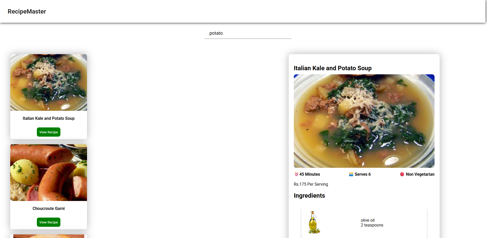

# RecipeMaster

A sleek and simple recipe search application built with ReactJS and the [Spoonacular API](https://spoonacular.com/food-api). Users can search for recipes using keywords, browse through results, and view complete cooking instructions—all on a single page.

---

## Features

- **Search Recipes** by ingredient, dish name, or cuisine  
- **View Full Recipe Instructions** without navigating away  
- Recipe cards with images, title, and basic info  
- Built with **ReactJS + Vite** for fast performance  
- Uses **Spoonacular API** for accurate and detailed data  

---

## Tech Stack

- ReactJS  
- Vite  
- Tailwind CSS
- Spoonacular API  

---

## Installation

```bash
git clone https://github.com/your-username/recipe-finder-app.git
cd recipe-finder-app
npm install
npm run dev
```

## Preview




---

## License

This project is open source and available under the [MIT License](LICENSE).

---

## Author

Made with ❤️ by [Sidharth Pandithar](https://github.com/sidharthpandithar)
